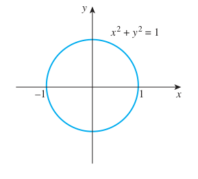
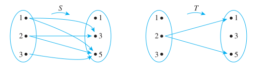
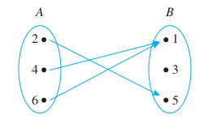
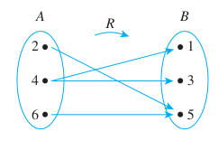
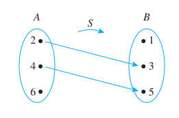

**Example 1.1.1**

Page 24

Use variables to rewrite the following sentences more formally.

a. Are there numbers with the property that the sum of their squares equals the
square of their sum?

b. Given any real number, its square is nonnegative.

**Solution**

a. Are there numbers $a$ and $b$ with the property that $a^2 + b^2 = (a + b)^2$?

_Or_: Are there numbers $a$ and $b$ such that $a^2 + b^2 = (a + b)^2$?

_Or_: Do there exist any numbers $a$ and $b$ such that $a^2 + b^2 = (a + b)^2$?

b. Given any real number $r$, $r^2$ is nonnegative.

_Or_: For any real number $r$, $r^2 \geq 0$.

_Or_: For every real number $r$, $r^2 \geq 0$.

---

**Example 1.1.2**

Page 26

Fill in the blanks to rewrite the following statement:

For every real number $x$, if $x$ is nonzero then $x^2$ is positive.

a. If a real number is nonzero, then its square ________.

b. For every nonzero real number $x$, ________.

c. If $x$ ________, then ________.

d. The square of any nonzero real number is ________.

e. All nonzero real numbers have ________.

**Solution**.

a. is positive.

b. $x^2$ is positive.

c. is a nonzero real number, $x^2$ is positive.

d. positive.

e. positive squares .

---

**Example 1.1.3**

Page 27

Fill in the blanks to rewrite the following statement: Every pot has a lid.

a. All pots ________.

b. For every pot $P$, there is ________.

c. For every pot $P$, there is a lid $L$ such that ________.

**Solution**

a. have lids.

b. a lid.

c. $L$ is a lid for $P$..

---

**Example 1.1.4**

Page 28

Fill in the blanks to rewrite the following statement in three different ways:

There is a person in my class who is at least as old as every person in my clas.

a. Some ________ is at least as old as ________.

b. There is a person $p$ in my class such that $p$ is ________.

c. There is a person $p$ in my class with the property that for every person $q$
in my class, $p$ is ________.

**Solution**

a. person; every person.

b. at least as old as every person in my class.

c. at least as old as $q$.

---

**Example 1.2.1**

Page 30

**Using the Set-Roster Notation**

a. Let $A = \{1, 2, 3\}$, $B = \{3, 1, 2\}$, and $C = \{1, 1, 2, 3, 3, 3\}$.
What are the elements of $A$, $B$, and $C$? How are $A$, $B$, and $C$ related?

b. Is $\{0\} = 0$?

c. How many elements are in the set $\{1, \{1}\}$?

d. For each nonnegative integer $n$, let $U_n = \{n, -n\}$. Find $U_1$, $U_2$,
and $U_0$.

**Solution**

a. Let $A = \{1, 2, 3\}$, $B = \{3, 1, 2\}$, and $C = \{1, 1, 2, 3, 3, 3\}$.
What are the elements of $A$, $B$, and $C$? How are $A$, $B$, and $C$ related?

$A$, $B$, and $C$ have exactly the same three elements, $1$, $2$, and $3$.
Therefore, $A$, $B$, and $C$ are simply different ways to represent the same
set.

b. Is $\{0\} = 0$?

$\{0\} \neq 0$ because $\{0\}$ is a set with one element, namely $0$, whereas
$0$ is just the symbol that represents the number zero.

c. How many elements are in the set $\{1, \{1}\}$?

The set $\{1, \{1\}\}$ has two elements. $1$ and the set whose only element is
$1$.

d. For each nonnegative integer $n$, let $U_n = \{n, -n\}$. Find $U_1$, $U_2$,
and $U_0$.

$U_1 = \{1, -1\}, \quad U_2 = \{2, -2\}, \quad U_0 = \{0, 0\} = \{0\}$

---

**Example 1.2.2**

Page 31

**Using the Set-Builder Notation**

Given that $\mathbb{R}$ denotes the set of all real numbers, $\mathbb{Z}$ the
set of all integers, and $\mathbb{Z}^+$ the set of all positive integers,
describe each of the following sets.

a. $\{x \in \mathbb{R} | -2 < x < 5\}$

b. $\{x \in \mathbb{Z} | -2 < x < 5\}$

c. $\{x \in \mathbb{Z}^+ | -2 < x < 5\}$

**Solution**

a. $\{x \in \mathbb{R} | -2 < x < 5\}$

$\{x \in \mathbb{R} | -2 < x < 5\}$ is the open interval of real numbers
(strictly) between $-2$ and 5. It is pictured as follows (see page 31).

b. $\{x \in \mathbb{Z} | -2 < x < 5\}$

$\{x \in \mathbb{Z} | -2 < x < 5\}$ is the set of all integers (strictly)
between $-2$ and $5$. It is equal to the set $\{-1, 0, 1, 2, 3, 4}$.

c. $\{x \in \mathbb{Z}^+ | -2 < x < 5\}$

Since all the integers in $\mathbb{Z}^+$ are positive,
$\{x \in \mathbb{Z}^+ | -2 < x < 5\} = \{1, 2, 3, 4\}$.

---

**Example 1.2.3**

Page 32

Let $A = \mathbb{Z}^+$, $B = \{n \in \mathbb{Z} | 0 \leq n \leq 100\}$, and
$C = \{100, 200, 300, 400, 500\}$. Evaluate the truth and falsity of each of the
following statements

a. $B \subseteq A$

b. $C$ is a proper subset of $A$.

c. $C$ and $B$ have at least one element in common

d. $C \subseteq B$

e. $C \subseteq C$

**Solution**

a. $B \subseteq A$

False. Zero is not a positive integer. Thus zero is in $B$ but zero is not in
$A$, and so $B \nsubseteq A$

b. $C$ is a proper subset of $A$.

True. Each element in $C$ is a positive integer, and hence, is in $A$, but there
are elements in $A$ that are not in $C$. For instance, $1$ is in $A$ and not in
$C$.

c. $C$ and $B$ have at least one element in common

True. For example, $100$ is in both $C$ and $B$.

d. $C \subseteq B$

False. For example, $200$ is in $C$ but not in $B$.

e. $C \subseteq C$

True. Every element in $C$ is in $C$. In general, the definition of a subset
implies that all sets are subsets of themselves.

---

**Example 1.2.4**

Page 33

**Distinction between $\in$ and $\subseteq$**

Which of the following are true statements?

a. $2 \in \{1, 2, 3\}$

b. $\{2\} \in \{1, 2, 3\}$

c. $2 \subseteq \{1, 2, 3\}$

d. $\{2\} \subseteq \{1, 2, 3\}$

e. $\{2\} \subseteq \{\{1\}, \{2\}\}$

f. $\{2} \in \{\{1\}, \{2\}\}$

**Solution**

Only (a), (d), and (f) are true.

For (b) to be true, the set $\{1, 2, 3\}$ would have to contain the element
$\{2\}$. But the only elements of $\{1, 2, 3\}$ are $1$, $2$, and $3$, and $2$
is not equal to $\{2\}$. Hence (b) is false.

For \(c\) to be true, the number $2$ would have to be a set and every element in
the set $2$ would have to be an element of $\{1, 2, 3}$. This is not the case,
so \(c\) is false.

For (e) to be true, every element in the set containing only the number $2$
would have to be an element of the set whose elements are $\{1\}$ and $\{2\}$.
But $2$ is not equal to either $\{1\}$ or $\{2\}$, and so (e) is false.

---

**Example 1.2.5 Ordered Pairs**

Page 34

a. Is $(1, 2) = (2, 1)$?

b. Is $\left(3, \dfrac{5}{10}\right) = \left(\sqrt{9}, \dfrac{1}{2}\right)$?

c. What is the first element of $(1, 1)$?

**Solution**

a. Is $(1, 2) = (2, 1)$?

No, By definition of equality of ordered pairs,

$(1, 2) = (2, 1)$ if, and only if, 1 = 2, and 2 = 1.

But $1 \neq 2$, and so the ordered pairs are not equal.

b. Is $\left(3, \dfrac{5}{10}\right) = \left(\sqrt{9}, \dfrac{1}{2}\right)$?

Yes. By definition of equality of ordered pairs,

$\left(3, \dfrac{5}{10}\right) = \left(\sqrt{9}, \dfrac{1}{2}\right)$ if, and
only if, $3 = \sqrt{9}$ and $\dfrac{5}{10} = \dfrac{1}{2}$.

Because these equations are both true, the ordered pairs are equal.

c. What is the first element of $(1, 1)$?

In the ordered pair $(1, 1)$, the first and second elements are both $1$.

---

**Example 1.2.6 Ordered $n$-tuples**

Page 34

a. Is $(1, 2, 3, 4) = (1, 2, 4, 3)$?

b. Is
$\left(3, (-2)^2, \dfrac{1}{2}\right) = \left(\sqrt{9}, 4, \dfrac{3}{6}\right)$?

**Solution**

a. Is $(1, 2, 3, 4) = (1, 2, 4, 3)$?

No. By definition of equality of ordered 4-tuples,

$$ (1, 2, 3, 4) = (1, 2, 4, 3) \leftrightarrow 1 = 1, 2 = 2, 3 = 4, and 4 = 3 $$

But $3 \neq 4$, and so the ordered 4-tuples are not equal.

b. Is
$\left(3, (-2)^2, \dfrac{1}{2}\right) = \left(\sqrt{9}, 4, \dfrac{3}{6}\right)$?

Yes. By definition of equality of ordered triples.

$$ \left(3, (-2)^2, \frac{1}{2}\right) = \left(\sqrt{9}, 4, \frac{3}{6}\right) \leftrightarrow 3 = \sqrt{9} \text{ and } (-2)^2 = 4 \text{ and } \frac{1}{2} = \frac{3}{6} $$

Because these equations are all true, the two ordered triples are equal.

---

**Example 1.2.7 Cartesian Products**

Page 35

Let $A = \{x, y\}$, $B = \{1, 2, 3\}$, and $C = \{a, b\}$.

a. Find $A \times B$.

b. Find $B \times A$.

c. Find $A \times A$.

d. How many elements are in $A \times B$, $B \times A$, and $A \times A$?

e. Find $(A \times B) \times C$

f. Find $A \times B \times C$

g. Let $\mathbb{R}$ denote the set of all real numbers. Describe
$\mathbb{R} times \mathbb{R}$.

**Solution**

a. Find $A \times B$.

$$ A \times B = \{(x, 1), (y, 1), (x, 2), (y, 2), (x, 3), (y, 3)\} $$

b. Find $B \times A$.

$$ B \times A = \{(1, x), (1, y), (2, x), (2, y), (3, x), (3, y)\} $$

c. Find $A \times A$.

$$ A \times A = \{(x, x), (x, y), (y, x), (y, y)\} $$

d. How many elements are in $A \times B$, $B \times A$, and $A \times A$?

$A \times B$ has 6 elements. Note that this is the number of elements in $A$
times the number of elements in $B$. $B \times A$ has 6 elements, the number of
elements in $B$ times the number of elements in $A$. $A \times A$ has 4
elements, the number of elements in $A$ times the number of elements in $A$.

e. Find $(A \times B) \times C$

$$ (A \times B) \times C = \{(u, v) | u \in A \times B \text{ and } v \in C\} $$

By definition of Cartesian product.

$$ (A \times B) \times C = \{((x, 1), a), ((x, 2), a), ((x, 3), a), ((y, 1), a), ((y, 2), a), ((y, 3), a), ((x, 1), b), ((x, 2), b), ((x, 3), b), ((y, 1), b), ((y, 2), b), ((y, 3), b)\} $$

f. Find $A \times B \times C$

The Cartesian product $A \times B \times C$ is superficially similar to but is
not quite the same mathematical object as $(A \times B) \times C$.
$(A \times B) \times C$ is a set of ordered pairs of which one element is itself
an ordered pair, whereas $A \times B \times C$ is a set of ordered triples. By
definition of Cartesian product,

$$ A \times B \times C = \{(u, v, w) | u \in A, v \in B, \text{ and } w \in C\} $$

$$ A \times B \times C = \{(x, 1, a), (x, 2, a), (x, 3, a), (y, 1, a), (y, 2, a), (y, 3, a), (x, 1, b), (x, 2, b), (x, 3, b), (y, 1, b), (y, 2, b), (y, 3, b)\} $$

g. Let $\mathbb{R}$ denote the set of all real numbers. Describe
$\mathbb{R} times \mathbb{R}$.

$\mathbb{R} \times \mathbb{R}$ is the set of all ordered pairs $(x, y)$ where
both $x$ and $y$ are real numbers. If horizontal and vertical axes are drawn on
a plane and a unit length is marked off, then each ordered pair in
$\mathbb{R} \times \mathbb{R}$ corresponds to a unique point in the plane, with
the first and second elements o the pair indicating, respectively, the
horizontal and vertical positions of the point. The term **Cartesian plane** is
often used to refer to a plane with this coordinate system, as illustrated in
Figure 1.2.1 (see page 36).

---

**Example 1.2.8 Strings**

Page 36

Let $A = \{a, b\}$. List all the strings of length 3 over $A$ with at least two
characters that are the same.

**Solution**

_aab, aba, baa, aaa, bba, bab, abb, bbb_

In computer programming it is important to distinguish among different kinds of
data structures and to respect the notations that are used for them. Similarly
in mathematics, it is important to distinguish among, say, _{a, b, c}, {{ab},
c}, (a, b, c), (a, (b, c)), abc_ and so forth, because these are all
significantly different objects.

---

**Example 1.3.1 A Relation as a Subset**

Page 39

Let $A = \{1, 2\}$ and $B = \{1, 2, 3\}$ and define a relation $R$ from $A$ to
$B$ as follows: Given any $(x, y) \in A \times B$.

$(x, y) \in R$ means that $\dfrac{x - y}{2}$ is an integer.

a. State explicitly which ordered pairs are in $A \times B$ and which are in
$R$.

b. Is 1 _R_ 3? Is 2 _R_ 3? Is 2 _R_ 2?

c. What are the domain and co-domain of _R_?

**Solution**

a. State explicitly which ordered pairs are in $A \times B$ and which are in
$R$.

$$ A \times B = \{(1, 1), (1, 2), (1, 3), (2, 1), (2, 2), (2, 3)\} $$

$$ (x, y) \in R = \{(A \times B) | \left(\frac{x - y}{2}\right) \in \mathbb{Z}\} $$

$$ R = \{(1, 1), (1, 3), (2, 2)\} $$

b. Is 1 _R_ 3? Is 2 _R_ 3? Is 2 _R_ 2?

Is 1 _R_ 3?: Yes, because $(1, 3) \in R$.

Is 2 _R_ 3? No, because $(2, 3) \notin R$.

Is 2 _R_ 2? Yes, because $(2, 2) \in R$.

c. What are the domain and co-domain of _R_?

The domain of _R_ is $\{1, 2\}$ and the co-domain of _R_ is $\{1, 2, 3\}$

---

**Example 1.3.2 The Circle Relation**

Page 40

Define a relation $C$ from $\mathbb{R}$ to $\mathbb{R}$ as follows: For any
$(x, y) \in \mathbb{R} \times \mathbb{R}$.

$(x, y) \in C$ means that $x^2 + y^2 = 1$.

a. Is $(1, 0) \in C$? Is $(0, 0) \in C$? Is
$\left(-\dfrac{1}{2}, \dfrac{\sqrt{3}}{2}\right) \in C$? Is -2 _C_ 0? Is 0 _C_
(-1)? Is 1 _C_ 1?

b. What are the domain and co-domain of _C_?

c. Draw a graph for _C_ by plotting the points of _C_ in the Cartesian plane.

**Solution**

a. Is $(1, 0) \in C$? Is $(0, 0) \in C$? Is
$\left(-\dfrac{1}{2}, \dfrac{\sqrt{3}}{2}\right) \in C$? Is -2 _C_ 0? Is 0 _C_
(-1)? Is 1 _C_ 1?

Is $(1, 0) \in C$?

Yes, $(1)^2 + (0)^2 = 1$

Is $(0, 0) \in C$?

No, $(0)^2 + (0)^2 = 0 \neq 1$

Is $\left(-\dfrac{1}{2}, \dfrac{\sqrt{3}}{2}\right) \in C$?

Yes,
$\left(-\frac{1}{2}\right)^2 + \left(\frac{\sqrt{3}}{2}\right)^2 = \frac{1}{4} + \frac{3}{4} = 1$

Is -2 _C_ 0?

No because $(-2)^2 + (0)^2 = 4 \neq 1$

Is 0 _C_ (-1)?

Yes because $(0)^2 + (-1)^2 = 1$.

Is 1 _C_ 1?

No, because $(1)^2 + (1)^2 = 2 \neq 1$.

b. What are the domain and co-domain of _C_?

The domain of _C_ is $\mathbb{R}$ and the co-domain of _C_ is also $\mathbb{R}$.

c. Draw a graph for _C_ by plotting the points of _C_ in the Cartesian plane.

This is just the circle formula, so:

---

**Example 1.3.3 Arrow Diagrams and Relations**

Page 41

Let $A = \{1, 2, 3\}$ and $B = \{1, 2, 3\}$ and define relations $S$ and $T$
from $A$ to $B$ as follows:

For every $(x, y) \in A \times B$,

$(x, y) \in S$ means that $x < y$ ($S$ is a "less than" relation).

$T = \{(2, 1), (2, 5)\}$.

Draw arrow diagrams for $S$ and $T$.

**Solution**

These example relations illustrate that it is possible to have several arrows
coming out of the same element of $A$ pointing in different directions. Also, it
is quite possible to have an element of $A$ that does not have an arrow coming
out of it.

---

**Example 1.3.4 Functions and Relations on Finite Sets**

Page 42

Let $A = \{2, 4, 6\}$ and $B = \{1, 3, 5\}$. Which of the relations $R$, $S$,
and $T$ defined below are functions from $A$ to $B$?

a. $R = \{(2, 5), (4, 1), (4, 3), (6, 5)\}$

b. For every $(x, y) \in A \times B$, $(x, y) \in S$ means that $y = x + 1$.

c. $T$ is defined by the arrow diagram

**Solution**

a. $R = \{(2, 5), (4, 1), (4, 3), (6, 5)\}$

$R$ is not a function because it does not satisfy property (2). The ordered
pairs $(4, 1)$ and $(4, 3)$ have the same first element but different second
elements. You can see this graphically if you draw the arrow diagram for $R$.
There are two arrows coming out of 4: One point to 1 and the other points to 3.

b. For every $(x, y) \in A \times B$, $(x, y) \in S$ means that $y = x + 1$.

$S$ is not a function because it does not satisfy property (1). It is not true
that every element of $A$ is the first element of an ordered pair in $S$. For
example $6 \in A$ but there is no $y$ in $B$ such that $y = 6 + 1 = 7$. You can
also see this graphically by drawing the arrow diagram for $S$.

c. $T$ is defined by the arrow diagram

$T$ is a function: Each element in $\{2, 4, 6\}$ is related to some element in
$\{1, 3, 5\}$, and no element in $\{2, 4, 6\}$ is related to more than one
element in $\{1, 3, 5\}$. When these properties are stated in terms of the arrow
diagram, they become (1) there is an arrow coming out of each element of the
domain, and (2) no element of the domain has more than one arrow coming out of
it. So you can write $T(2) = 5$, $T(4) = 1$, $T(6) = 1$.

---

**Example 1.3.5 Functions and Relations on Sets of Strings**

Page 43

Let $A = \{a, b\}$ and let $S$ be the set of all strings over $A$.

a. Define a relation $L$ from $S$ to $\mathbb{Z}^{\text{nonneg}}$ as follows:
For every string $s$ in $S$ and for every nonnegative integer $n$,

$$ (s, n) \in L \text{ means that the length of } s \text{ is } n $$

Observe that $L$ is a function because every string in $S$ has one and only one
length. Find _L(abaaba)_ and _L(bbb)_.

b. Define a relation $C$ from $S$ to $S$ as follows: For all strings $s$ and $t$
in $S$,

$$ (s, t) \in C \text{ means that } t = as $$

where $as$ is the string obtained by appending $a$ on the left of the characters
in $s$. ($C$ is called **concatenation** by $a$ on the left.) Observe that $C$
is a function because every string in $S$ consists entirely of $a$'s and $b$'s
and adding an additional $a$ on the left creates a new string that also consists
of $a$'s and $b$'s and thus is also in $S$. Find _C(abaaba)_ and _C(bbb)_.

**Solution**

a. Define a relation $L$ from $S$ to $\mathbb{Z}^{\text{nonneg}}$ as follows:
For every string $s$ in $S$ and for every nonnegative integer $n$,

$$ (s, n) \in L \text{ means that the length of } s \text{ is } n $$

Observe that $L$ is a function because every string in $S$ has one and only one
length. Find _L(abaaba)_ and _L(bbb)_.

_L(abaaba)_ = 6

_L(bbb)_ = 3

b. Define a relation $C$ from $S$ to $S$ as follows: For all strings $s$ and $t$
in $S$,

$$ (s, t) \in C \text{ means that } t = as $$

where $as$ is the string obtained by appending $a$ on the left of the characters
in $s$. ($C$ is called **concatenation** by $a$ on the left.) Observe that $C$
is a function because every string in $S$ consists entirely of $a$'s and $b$'s
and adding an additional $a$ on the left creates a new string that also consists
of $a$'s and $b$'s and thus is also in $S$. Find _C(abaaba)_ and _C(bbb)_.

_C(abaaba)_ = aabaaba

_C(bbb)_ = abbb

---

**Example 1.3.6 Functions Defined by Formulas**

Page 44

The **squaring function** $f$ from $\mathbb{R}$ to $\mathbb{R}$ is defined by
the formula $f(x) = x^2$ for every real number $x$. This means that no matter
what real number input is substituted for $x$, the output of $f$ will be the
square of that number. The idea can be represented by writing
$f(\Box) = \Box^2$. In other words, $f$ sends each real number $x$ to $x^2$, or
symbolically, $f: x \to x^2$. Note that the variable $x$ is a dummy variable;
any other symbol could replace it, as long as the replacement is made everywhere
the $x$ appears.

The **successor function** $g$ from $\mathbb{Z}$ to $\mathbb{Z}$ is defined by
the formula $g(n) = n + 1$. Thus, no matter what integer is substituted for $n$,
the output of $g$ will be that number plus $1$: $g(\Box) = \Box + 1$. In other
words, $g$ sends each integer $n$ to $n + 1$, or, symbolically,
$g: n \to n + 1$.

An example of a **constant function** is the function $h$ from $\mathbb{Q}$ to
$\mathbb{Z}$ defined by the formula $h(r) = 2$ for all rational numbers $r$.
This function sends each rational number $r$ to $2$. In other words, no matter
what the input, the output is always $2$: $h(\Box) = 2$ or $h: r \to 2$.

The functions $f$, $g$, and $h$, are represented by the function machines in
Figure 1.3.2 (see page 44).

A function is an entity in its own right. It can be thought of as a certain
relationship between sets or as an input/output machine that operates according
to a certain rule. This is the reason why a function is generally denoted by a
single symbol or string of symbols, such as $f$, $G$, or $\log$, or $\sin$.

A relation is a subset of a Cartesian product and a function is a special kind
of relation. Specifically, if $f$ and $g$ are functions from a set $A$ to a set
$B$, then

$$ f = \{(x, y) \in A \times B | y = f(x)\} \quad \text{ and } g(x) = \{(x, y) \in A \times B | y = g(x)\} $$

It follows that

$$ f \text{ equals } g, \quad \text{ written } f = g, \quad \text{ if, and only if, } f(x) = g(x) \text{ for all } x \text{ in } A $$

---

**Example 1.3.7 Equality of Functions**

Page 44

Define functions $f$ and $g$ from $\mathbb{R}$ to $\mathbb{R}$ by the following
formulas:

$$ f(x) = |x| \quad \text{ for every } x \in \mathbb{R} $$

$$ g(x) = \sqrt{x^2} \quad \text{ for every } x \in \mathbb{R} $$

Does $f = g$?

**Solution**

Yes. Because the absolute value of any real number equals the square root of its
square, $|x| = \sqrt{x^2}$ for all $x \in \mathbb{R}$. Hence $f = g$.
