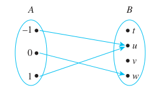
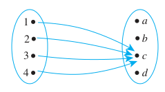
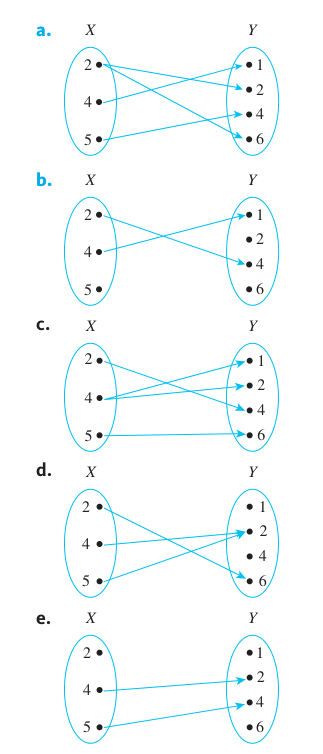

**Exercise Set 1.1**

Page 28

In each of 1-6, fill in the blanks using a variable or variables to rewrite the
given statement.

1. Is there a real number whose square is $-1$?

a. Is there a real number $x$ such that ______?

b. Does there exist ______ such that $x^2 = -1$?

**Solution**

a. Is there a real number $x$ such that $x^2 = -1$?

b. Does there exist a real number $x$ such that $x^2 = -1$?

2. Is there an integer that has a remainder of $2$ when it is divided by $5$ and
   a remainder of $3$ when it is divided by $6$?

a. Is there an integer $n$ such that $n$ has ______?

b. Does there exist ______ such that if $n$ is divided by $5$ the remainder is
$2$ and if ______?

_Note: There are integers with this property. Can you think of one?_

**Solution**

a. Is there an integer $n$ such that $n$ has a remainder of $2$ when $n$ is
divided by $5$ and a remainder of $3$ when $n$ is divided by $6$?

b. Does there exist a number $n$ such that if $n$ is divided by $5$ the
remainder is $2$ and if $n$ is divided by $6$ the remainder is $3$?

_Note: There are integers with this property. Can you think of one?_

$$ 27 \mod 5 = 2 $$

$$ 27 \mod 6 = 3 $$

3. Given any two distinct real numbers, there is a real number in between them.

a. Given any two distinct real numbers $a$ and $b$, there is a real number $c$
such that $c$ is ______.

b. For any two ______, ______ such that $c$ is between $a$ and $b$.

**Solution**

a. Given any two distinct real numbers $a$ and $b$, there is a real number $c$
such that $c$ is $a \leq c \leq b$.

b. For any two distinct real numbers $a$ and $b$, there exists a real number $c$
such that $c$ is between $a$ and $b$.

4. Given any real number, there is a real number that is greater.

a. Given any real number $r$, there is ______ $s$ such that $s$ is ______

b. For any ______, ______ such that $s > r$.

**Solution**

a. Given any real number $r$, there is a real number $s$ such that $s$ is
greater than $r$.

b. For any real number $r$, there exists a real number $s$ such that $s > r$.

5. The reciprocal of any positive real number is positive.

a. Given any positive real number $r$, the reciprocal of ______.

b. For any real number $$, if $r$ is ______, then ______.

c. If a real number $r$ ______, then ______.

**Solution**

a. Given any positive real number $r$, the reciprocal of $r$ is positive.

b. For any real number $r$, if $r$ is positive, then the reciprocal of $r$ is
positive.

c. If a real number $r$ is positive, then the reciprocal of $r$ is positive.

6. The cube root of any negative real number is negative.

a. Given any negative real number $s$, the cube root of ______.

b. For any real number $s$, if $s$ is ______, then ______.

c. If a real number $s$ ______, then ______.

**Solution**

a. Given any negative real number $s$, the cube root of $s$ is negative.

b. For any real number $s$, if $s$ is negative, then the cube root of $s$ is
negative.

c. If a real number $s$ is negative, then the cube root of $s$ is negative.

7. Rewrite the following statements less formally, without using variables.
   Determine, as best as you can, whether the statements are true or false.

a. There are real numbers $u$ and $v$ with the property that $u + v < u - v$.

b. There is a real number $x$ such that $x^2 < x$.

c. For every positive integer $n$, $n^2 \geq n$.

d. For all real numbers $a$ and $b$, $|a + b| \leq |a| + |b|$.

**Solution**

a. There are real numbers $u$ and $v$ with the property that $u + v < u - v$.

There are two distinct real numbers where the sum of those two numbers is less
than the difference of those two numbers.

This is true if you consider our domain is all real numbers which include
negatives. For example:

$$ 1 + (-1) = 0 $$

$$ 1 - (-1) = 2 $$

$$ 0 < 2 $$

b. There is a real number $x$ such that $x^2 < x$.

There is a real number which is greater than it's square.

This is true for any fraction/decimal. Consider:

$$ \left(\frac{1}{4}\right)^2 = \frac{1}{16} $$

$$ \frac{1}{16} < \frac{1}{4} $$

c. For every positive integer $n$, $n^2 \geq n$.

For all positive integers, an integer's square is always greater than or equal
to the integer.

This is true. Starting at $1$ we get $1^2 \geq 1$, which is true, $2^2 \geq 2$
is true, and so on. We're essentially multiplying each side of the inequality by
some positive integer, which we know from algebra does not change the direction
of the inequality, so this statement holds true.

d. For all real numbers $a$ and $b$, $|a + b| \leq |a| + |b|$.

For any two distinct real numbers, the absolute value of their sum is less than
or equal to the sum of the absolute values of each number.

This is true, if both $a$ and $b$ are positive numbers or both $a$ and $b$ are
negative integers, then the two statements are equal. If either $a$ or $b$ is
negative and the other is positive, then the left statement will always be less
than the right hand statement.

---

In each of 8-13, fill in the blanks to rewrite the given statement.

8. For every object $J$, if $J$ is a square then $J$ has four sides.

a. All squares ______.

b. Every square ______.

c. If an object is a square, then it ______.

d. If $J$ ______, then $J$ ______.

e. For every square $J$, ______.

**Solution**

a. All squares have four sides.

b. Every square has four sides.

c. If an object is a square, then it has four sides.

d. If $J$ is a square, then $J$ has four sides.

e. For every square $J$, $J$ has four sides.

9. For every equation $E$, if $E$ is quadratic then $E$ has at most two real
   solutions.

a. All quadratic equations ______.

b. Every quadratic equation ______.

c. If an equation is quadratic, then it ______.

d. If $E$ ______, then $E$ ______.

e. For every quadratic equation $E$, ______.

**Solution**

a. All quadratic equations have at most two real solutions.

b. Every quadratic equation has at most two real solutions.

c. If an equation is quadratic, then it has at most two real solutions.

d. If $E$ is a quadratic equation, then $E$ has at most two real solutions.

e. For every quadratic equation $E$, $E$ has at most two real solutions.

10. Every nonzero real number has a reciprocal.

a. All nonzero real numbers ______.

b. For every nonzero real number $r$, there is ______ for $r$.

c. For every nonzero real number $r$, there is a real number $s$ such that
______.

**Solution**

a. All nonzero real numbers have reciprocals.

b. For every nonzero real number $r$, there is a reciprocal for $r$.

c. For every nonzero real number $r$, there is a real number $s$ such that $s$
is a reciprocal of $r$.

11. Every positive number has a positive square root.

a. All positive numbers ______.

b. For every positive number $e$, there is ______ for $e$.

c. For every positive number $e$, there is a positive number $r$ such that
______.

**Solution**

a. All positive numbers have positive square roots.

b. For every positive number $e$, there is a positive square root for $e$.

c. For every positive number $e$, there is a positive number $r$ such that $r$
is a positive square root for $e$.

12. There is a real number whose product with every number leaves the number
    unchanged.

a. Some ______ has the property that its ______.

b. There is a real number $r$ such that the product of $r$ ______.

c. There is a real number $r$ with the property that for every real number $s$,
______.

**Solution**

a. Some real number has the property that its product with every number leaves
the number unchanged.

b. There is a real number $r$ such that the product of $r$ with every number
leaves $r$ unchanged.

c. There is a real number $r$ with the property that for every real number $s$,
such that $rs = s$.

13. There is a real number whose product with every real number equals zero.

a. Some _____ has the property that its ______.

b. There is a real number $a$ such that the product of $a$ ______.

c. There is a real number $a$ with the property that for every real number $b$,
______.

**Solution**

a. Some real number has the property that its product with every real number
equals zero.

b. There is a real number $a$ such that the product of $a$ with every real
number equals zero.

c. There is a real number $a$ with the property that for every real number $b$,
$ab = 0$.

---

**Exercise Set 1.2**

Page 37

1. Which of the following sets are equal?

$$ A = \{a, b, c, d\} $$

$$ B = \{d, e, a, c\} $$

$$ C = \{d, b, a, c\} $$

$$ D = \{a, a, d, e, c, e\} $$

**Solution**

$$ A = C $$

$$ B = D $$

2. Write in words how to read each of the following out loud.

a. $\{x \in \mathbb{R}^+ | 0 < x < 1\}$

b. $\{x \in \mathbb{R} | x \leq 0 \text{ or } x \geq 1\}$

c. $\{n \in \mathbb{Z} | n \text{ is a factor of } 6\}$

d. $\{n \in \mathbb{Z}^+ | n \text{ is a factor of } 6\}$

**Solution**

a. $\{x \in \mathbb{R}^+ | 0 < x < 1\}$

The set of all positive real numbers $x$ such that $x$ is greater than $0$ and
less than $1$.

b. $\{x \in \mathbb{R} | x \leq 0 \text{ or } x \geq 1\}$

The set of all real numbers $x$ such that $x$ is less than or equal to $0$ or
$x$ is greater than or equal to $1$.

c. $\{n \in \mathbb{Z} | n \text{ is a factor of } 6\}$

The set of all integers $n$ such that $n$ is a factor of $6$.

d. $\{n \in \mathbb{Z}^+ | n \text{ is a factor of } 6\}$

The set of all positive integers $n$ such that $n$ is a factor of $6$.

3.

a. Is $4 = \{4\}$?

b. How many elements are in the set $\{3, 4, 3, 5\}$?

c. How many elements are in the set $\{1, \{1\}, \{1, \{1\}\}\}$ ?

**Solution**

a. Is $4 = \{4\}$?

No, the symbol $4$, which represents the number four, does not equal the set
that contains an element that is the number $4$.

b. How many elements are in the set $\{3, 4, 3, 5\}$?

There are 3 elements in the set $\{3, 4, 3, 5\}$. Repeated elements are not
counted as more than 1 element in a set.

c. How many elements are in the set $\{1, \{1\}, \{1, \{1\}\}\}$ ?

There are three elements in the set, namely the symbol $1$, the set $\{1\}$, and
the set $\{1, \{1\}\}$.

4.

a. Is $2 \in \{2}$ ?

b. How many elements are in the set $\{2, 2, 2, 2\}$ ?

c. How many elements are in the set $\{0, \{0\}\}$ ?

d. Is $\{0\} \in \{\{0\}, \{1\}\}$ ?

e. Is $0 \in \{\{0\}, \{1\}\}$ ?

**Solution**

a. Is $2 \in \{2}$ ?

No, the symbol $2$ which represents the number two, is not equal to the set
$\{2\}$, which is a set that contains the element $2$.

b. How many elements are in the set $\{2, 2, 2, 2\}$ ?

There is one element in the set $\{2, 2, 2, 2\}$, namely the element $2$.

c. How many elements are in the set $\{0, \{0\}\}$ ?

There are two elements in the set, namely the symbol $0$, and the set $\{0\}$.

d. Is $\{0\} \in \{\{0\}, \{1\}\}$ ?

Yes, the set of $\{0\}$ is in the set $\{\{0\}, \{1\}\}$, as the set contains
both the sets $\{0\}$ and $\{1\}$.

e. Is $0 \in \{\{0\}, \{1\}\}$ ?

No, the symbol $0$, representing the number zero, is not in the set, which holds
two sets with the symbols in them.

5. Which of the following sets are equal?

$$
A = \{0, 1, 2\} \\
B = \{x \in \mathbb{R} | -1 \leq x < 3\} \\
C = \{x \in \mathbb{R} | -1 < x < 3\} \\
D = \{x \in \mathbb{Z} | -1 < x < 3\} \\
E = \{x \in \mathbb{Z}^+ | -1 < x < 3\}
$$

**Solution**

None of these sets are equal. $A = E$ might have worked had $A$ not included
$0$, but $E$ essentially evaluates to $E = \{1, 2\}$, and does not include $0$.

6. For each integer $n$, let $T_n = \{n, n^2\}$. How many elements are in each
   of $T_2, T_{-3}, T_1$, and $T_0$? Justify your answers.

**Solution**

$$ T_2 = \{2, 2^2\} = \{2, 4\} \quad \text{ two elements } $$

$$ T_{-3} = \{-3, (-3)^2\} = \{-3, 9\} \quad \text{ two elements }$$

$$ T_1  = \{1, 1^2\} = \{1, 1\} = \{1\} \quad \text{ one element } $$

$$ T_0 = \{0, 0^2\} = \{0, 0\} = \{0\} \quad \text{ one element } $$

7. Use the set-roster notation to indicate the elements in each of the following
   sets.

a. $S = \{n \in \mathbb{Z} | n = (-1)^k \text{, for some integer } k\}$

b. $T = \{m \in \mathbb{Z}| m = 1 + (-1)^i \text{, for some integer } i\}$

c. $U = \{r \in \mathbb{Z} | 2 \leq r \leq -2\}$

d. $V = \{s \in \mathbb{Z} | s > 2 \text{ or }x < 3\}$

e. $W = \{t \in \mathbb{Z} | 1 < t < -3\}$

f. $X = \{u \in \mathbb{Z} | u \leq 4 \text{ or } u \geq 1\}$

**Solution**

a. $S = \{n \in \mathbb{Z} | n = (-1)^k \text{, for some integer } k\}$

$$ \{-1, 1\} $$

b. $T = \{m \in \mathbb{Z}| m = 1 + (-1)^i \text{, for some integer } i\}$

$$ \{0, 2\} $$

c. $U = \{r \in \mathbb{Z} | 2 \leq r \leq -2\}$

$$ \emptyset $$

d. $V = \{s \in \mathbb{Z} | s > 2 \text{ or }x < 3\}$

$$ \mathbb{Z} $$

e. $W = \{t \in \mathbb{Z} | 1 < t < -3\}$

$$ \emptyset $$

f. $X = \{u \in \mathbb{Z} | u \leq 4 \text{ or } u \geq 1\}$

$$ \mathbb{Z}^+ $$

8. Let $A = \{c, d, f, g\}$, $B = \{f, j\}$, and $C = \{d, g\}$. Answer each of
   the following questions. Give reasons for your answers.

a. Is $B \subseteq A$?

b. Is $C \subseteq A$?

c. Is $C \subseteq C$?

d. Is $C$ a proper subset of $A$?

**Solution**

a. Is $B \subseteq A$?

No, because every element of $B$ must be an element of $A$ by definition of a
subset, but $j \in B$, but $j \notin A$.

b. Is $C \subseteq A$?

Yes, every element of $C$ is an element of $A$.

c. Is $C \subseteq C$?

Yes, every element of $C$ is an element of $C$. By implication, every set is a
subset of itself.

d. Is $C$ a proper subset of $A$?

Yes, $C \subset A$, but $C \neq A$. Every element of $C$ is an element of $A$,
but $C$ does not equal $A$, which is the definition of a proper subset.

9.

a. Is $3 \in \{1, 2, 3\}$?

b. Is $1 \subseteq \{1}$?

c. Is $\{2\} \in \{1, 2\}$?

d. Is $\{3\} \in \{1, \{2\}, \{3\}\}$?

e. Is $1 \in \{1\}$?

f. Is $\{2\} \subseteq \{1, \{2\}, \{3\}\}$?

g. Is $\{1\} \subseteq \{1, 2\}$?

h. Is $1 \in \{\{1\}, 2\}$?

i. Is $\{1\} \subseteq \{1, \{2\}\}$?

j. Is $\{1\} \subseteq \{1\}$?

**Solution**

a. Is $3 \in \{1, 2, 3\}$?

Yes, the symbol $3$, representing the number three, is in the set $\{1, 2, 3\}$.

b. Is $1 \subseteq \{1}$?

No, the number $1$ is not a set, and therefore cannot be a subset of $\{1\}$.

c. Is $\{2\} \in \{1, 2\}$?

No, the subset $\{2\}$ is not in the set $\{1, 2\}$, the number $2$ is in the
subset, but not the set $\{2\}$.

d. Is $\{3\} \in \{1, \{2\}, \{3\}\}$?

Yes, the set $\{3\}$ is an element of $\{1, \{2\}, \{3\}\}$.

e. Is $1 \in \{1\}$?

Yes, the number $1$ is in the set $\{1\}$.

f. Is $\{2\} \subseteq \{1, \{2\}, \{3\}\}$?

No, the set $\{2\}$ holds the element $2$, and $2$ is not an element in
$\{1, \{2\}, \{3\}\}$.

g. Is $\{1\} \subseteq \{1, 2\}$?

Yes, the set $\{\1}$ holds the element $1$, and $1$ is an element of $\{1, 2\}$.

h. Is $1 \in \{\{1\}, 2\}$?

No, the element $1$ is not in $\{\{1\}, 2\}$.

i. Is $\{1\} \subseteq \{1, \{2\}\}$?

Yes, the set $\{1\}$ holds the element $1$, which is an element of
$\{1, \{2\}\}$.

j. Is $\{1\} \subseteq \{1\}$?

Yes $\{1\}$ holds the element $1$, which is an element of $\{1\}$. They are
equal and it is implied that any set is a subset of itself.

10.

a. Is $((-2)^2, -2^2) = (-2^2, (-2)^2)$?

b. Is $(5, -5) = (-5, 5)$?

c. Is $(8 - 9, \sqrt[3]{-1}) = (-1, -1)$?

d. Is $\left(\dfrac{-2}{-4}, (-2)^3\right) = \left(\dfrac{3}{6}, -8\right)$

**Solution**

a. Is $((-2)^2, -2^2) = (-2^2, (-2)^2)$?

$$ ((-2)^2, -2^2) = (4, -4) \neq (-4, 4) = (-2^2, (-2)^2) $$

So no, they are not equal. For ordered pair tuples to be equal, the order
matters and so each entry into the tuple must match the other for them to be
equal.

b. Is $(5, -5) = (-5, 5)$?

No, ordered pair tuples require that the entries be equal to each other _in
order_.

c. Is $(8 - 9, \sqrt[3]{-1}) = (-1, -1)$?

$$ (8 - 9, \sqrt[3]{-1}) = (-1, -1) = (-1, -1) $$

So yes, these two ordered pair tuples are equal.

d. Is $\left(\dfrac{-2}{-4}, (-2)^3\right) = \left(\dfrac{3}{6}, -8\right)$

$$ \left(\dfrac{-2}{-4}, (-2)^3\right) = \left(\frac{1}{2}, -8\right) = \left(\frac{1}{2}, -8\right) = \left(\dfrac{3}{6}, -8\right) $$

So yes, these two ordered pair tuples are equal.

11. Let $A = \{w, x, y, z\}$ and $B = \{a, b\}$. Use set-roster notation to
    write each of the following sets, and indicate the number of elements that
    are in each set.

a. $A \times B$

b. $B \times A$

c. $A \times A$

d. $B \times B$

**Solution**

a. $A \times B$

$$ A \times B = \{(w, a), (w, b), (x, a), (x, b), (y, a), (y, b), (z, a), (z, b)\} $$

There are 8 elements in $A \times B$.

b. $B \times A$

$$ B \times A = \{(a, w), (b, w), (a, x), (b, x), (a, y), (b, y), (a, z), (b, z)\} $$

There are 8 elements in $B \times A$.

c. $A \times A$

$$ A \times A = \{(w, w), (w, x), (w, y), (w, z), (x, w), (x, x), (x, y), (x, z), (y, w), (y, x), (y, y), (y, z), (z, w), (z, x), (z, y), (z, z)\} $$

There are 16 elements in $A \times A$.

d. $B \times B$

$$ B \times B = \{(a, a), (a, b), (b, a), (b, b)\} $$

There are 4 elements in $B \times B$.

12. Let $S = \{2, 4, 6\}$ and $T = \{1, 3, 5\}$. Use the set-roster notation to
    write each of the following sets, and indicate the number of elements that
    are in each set.

a. $S \times T$

b. $T \times S$

c. $S \times S$

d. $T \times T$

**Solution**

a. $S \times T$

$$ S \times T = \{(2, 1), (2, 3), (2, 5), (4, 1), (4, 3), (4, 5), (6, 1), (6, 3), (6, 5)\} $$

There are 9 elements in $S \times T$.

b. $T \times S$

$$ T \times S = \{(1, 2), (1, 4), (1, 6), (3, 2), (3, 4), (3, 6), (5, 2), (5, 4), (5, 6)\} $$

There are 9 elements in $T \times S$.

c. $S \times S$

$$ S \times S = \{(2, 2), (2, 4), (2, 6), (4, 2), (4, 4), (4, 6), (6, 2), (6, 4), (6, 6)\} $$

There are 9 elements in $S \times S$.

d. $T \times T$

$$ T \times T = \{(1, 1), (1, 3), (1, 5), (3, 1), (3, 3), (3, 5), (5, 1), (5, 3), (5, 5)\} $$

There are 9 elements in $T \times T$.

13. Let $A = \{1, 2, 3\}$, $B = \{u\}$, and $C = \{m, n\}$. Find each of the
    following sets.

a. $A \times (B \times C)$

b. $(A \times B) \times C$

c. $A \times B \times C$

**Solution**

a. $A \times (B \times C)$

$$ B \times C = \{(u, m), (u, n)\} $$

$$ A \times (B \times C) = \{(1, (u, m)), (1, (u, n)), (2, (u, m)), (2, (u, n)), (3, (u, m)), (3, (u, n))\} $$

b. $(A \times B) \times C$

$$ A \times B = \{(1, u), (2, u), (3, u)\} $$

$$ (A \times B) \times C = \{((1, u), m), ((1, u), n), ((2, u), m), ((2, u), n), ((3, u), m), ((3, u), n)\} $$

c. $A \times B \times C$

$$ A \times B \times C = \{(1, u, m), (1, u, n), (2, u, m), (2, u, n), (3, u, m), (3, u, n)\} $$

14. Let $R = \{a\}$, $S = \{x, y\}$, and $T = \{p, q, r\}$. Find each of the
    following sets.

a. $R \times (S \times T)$

$$ S \times T = \{(x, p), (x, q), (x, r), (y, p), (y, q), (y, r)\} $$

$$ R \times (S \times T) = \{(a, (x, p)), (a, (x, q)), (a, (x, r)), (a, (y, p)), (a, (y, q)), (a, (y, r))\} $$

b. $(R \times S) \times T$

$$ R \times S = \{(a, x), (a, y)\} $$

$$ (R \times S) \times T = \{((a, x), p), ((a, x), q), ((a, x), r), ((a, y), p), ((a, y), q), ((a, y), r)\} $$

c. $R \times S \times T$

**Solution**

$$ R \times S \times T = \{(a, x, p), (a, x, q), (a, x, r), (a, y, p), (a, y, q), (a, y, r)\} $$

a. $R \times (S \times T)$

b. $(R \times S) \times T$

c. $R \times S \times T$

15. Let $S = \{0, 1\}$. List all the strings of length 4 over $S$ that contain
    three or more $0$'s.

**Solution**

0000, 0001, 0010, 0100, 1000

16. Let $T = \{x, y\}$. List all the strings of length 5 over $T$ that have
    exactly one $y$.

**Solution**

xxxxy, xxxyx, xxyxx, xyxxx, yxxxx

---

**Exercise Set 1.3**

Page 45

1. Let $A = \{2, 3, 4\}$ and $B = \{6, 8, 10\}$ and define a relation $R$ from
   $A$ to $B$ as follows: For every $(x, y) \in A \times B$,

$$ (x, y) \in R \quad \text{ means that } \frac{y}{x} \text{ is an integer.} $$

**Solution**

a.

Is 4 _R_ 6?

No, $\dfrac{6}{4} = \dfrac{3}{2}$, which is not an integer.

Is 4 _R_ 8?

Yes, $\dfrac{8}{4} = 2$, which is an integer.

Is $(3, 8) \in R$?

No, $\dfrac{8}{3}$ is not an integer.

Is $(2, 10) \in R$?

Yes, $\dfrac{10}{2} = 5$ which is an integer.

b. Write _R_ as a set of ordered pairs.

$$ R = \{(2, 6), (2, 8), (2, 10), (3, 6), (4, 8)\} $$

c. Write the domain and co-domain of _R_.

The domain of _R_ is $\{2, 3, 4\}$.

The co-domain of _R_ is $\{6, 8, 10\}$.

d. Draw an arrow diagram for _R_.

2. Let $C = D = \{-3, -2, -1, 1, 2, 3\}$ and define a relation $S$ from $C$ to
   $D$ as follows: For every $(x, y) \in C \times D$,

$$ (x, y) \in S \quad \text{ means that } \frac{1}{x} - \frac{1}{y} \text{ is an integer.} $$

**Solution**

a.

Is 2 _S_ 2?

Yes, $\dfrac{1}{2} - \dfrac{1}{2} = 0 \in \mathbb{Z}$.

Is -1 _S_ -1?

Yes $\dfrac{1}{-1} - \dfrac{1}{-1} = 0 \in \mathbb{Z} $

Is $(3, 3) \in S$?

Yes $\dfrac{1}{3} - \dfrac{1}{3} = 0 \in \mathbb{Z} $

Is $(3, -3) \in S$?

No, $\dfrac{1}{3} - \dfrac{1}{-3} = \dfrac{2}{3} \notin \mathbb{Z} $

b. Write _S_ as a set of ordered pairs.

$$ S = \{(-3, -3), (-2, -2), (-1, -1), (1, 1), (2, 2), (3, 3)\} $$

c. Write the domain and co-domain of _S_.

The domain and co-domain of _S_ is $\{-3, -2, -1, 1, 2, 3\}$.

d. Draw an arrow diagram for _S_.

3. Let $E = \{1, 2, 3\}$ and $F = \{-2, -1, 0\}$ and define a relation $T$ from
   $E$ to $F$ as follows: For every $(x, y) \in E \times F$,

$$ (x, y) \in T \quad \text{ means that } \frac{x - y}{3} \text{ is an integer.} $$

**Solution**

a.

Is 3 _T_ 0?

Yes, $\dfrac{3 - 0}{3} = 1 \in \mathbb{Z}$.

Is 1 _T_ (-1)?

No, $\dfrac{(1) - (-1)}{3} = \dfrac{2}{3} \notin \mathbb{Z}$.

Is $(2, -1) \in T$?

Yes, $\dfrac{(2) - (-1)}{3} = 1 \in \mathbb{Z}$.

Is $(3, -2) \in T$?

No, $\dfrac{(3) - (-2)}{3} = \dfrac{5}{3} \notin \mathbb{Z}$.

b. Write $T$ as a set of ordered pairs.

$$ T = \{(1, -2), (2, -1), (3, 0)\} $$

c. Write the domain and co-domain of $T$.

The domain of $T$ is $\{1, 2, 3\}$, and the co-domain of $T$ is $\{-2, -1, 0\}$.

d. Draw an arrow diagram for $T$.

4. Let $G = \{-2, 0, 2\}$ and $H = \{4, 6< 8\}$ and define a relation $V$ from
   $G$ to $H$ as follows: For every $(x, y) \in G \times H$,

$$ (x, y) \in V \quad \text{ means that } \frac{x - y}{4} \text{ is an integer.} $$

**Solution**

a.

Is 2 _V_ 6?

Yes, $\dfrac{(2) - (6)}{4} = -1 \in \mathbb{Z}$.

Is (-2) _V_ (8)?

No, $\dfrac{(-2) - (8)}{4} = -\dfrac{10}{4} = -\dfrac{5}{2} \notin \mathbb{Z}$.

Is $(0, 6) \in V$?

No, $\dfrac{(0) - (6)}{4} = -\dfrac{6}{4} = -\dfrac{3}{2} \notin \mathbb{Z}$.

Is $(2, 4) \in V$?

No, $\dfrac{(2) - (4)}{4} = -\dfrac{1}{2} \notin \mathbb{Z}$.

b. Write $V$ as a set of ordered pairs.

$$ V = \{(-2, 6), (0, 4), (0, 8), (2, 6)\} $$

c. Write the domain and co-domain of _V_.

The domain of _V_ is $\{-2, 0, 2\}$ and the co-domain of _V_ is $\{4, 6, 8\}$

d. Draw an arrow diagram for _V_.

5. Define a relation $S$ from $\mathbb{R}$ to $\mathbb{R}$ as follows: For every
   $(x, y) \in \mathbb{R} \times \mathbb{R}$,

$$ (x, y) \in S \quad \text{ means that } x \geq y $$

**Solution**

a.

Is $(2, 1) \in S$?

Yes, $(2) \geq (1)$.

Is $(2, 2) \in S$?

Yes, $(2) \geq (2)$.

Is 2 _S_ 3?

No, $(2) \cancel{\geq} (3)$.

Is (-1) _S_ (-2)?

Yes, $(-1) \geq (-2)$.

b. Draw the graph of _S_ in the Cartesian plane.

6. Define a relation $R$ from $\mathbb{R}$ to $\mathbb{R}$ as follows: For every
   $(x, y) \in \mathbb{R} \times \mathbb{R}$,

$$ (x, y) \in R \quad \text{ means that } y = x^2  $$

**Solution**

a.

Is $(2, 4) \in R$?

Yes, $(4) = (2)^2$.

Is $(4, 2) \in R$?

No, $(2) \neq (4)^2$.

Is (-3) _R_ 9?

Yes, $(9) = (-3)^2$.

Is 9 _R_ (-3)?

No, $(-3) \neq (9)^2$.

b. Draw the graph of _R_ in the Cartesian plane.

7. Let $A = \{4, 5, 6\}$ and $B = \{5, 6, 7\}$ and define relations $R$, $S$,
   and $T$ from $A$ to $B$ as follows: For every $(x, y) \in A \times B$:

$$ (x, y) \in R \quad \text{ means that } x \geq y $$

$$ (x, y) \in S \quad \text{ means that } \frac{x - y}{2} \text{ is an integer.} $$

$$ T = \{(4, 7), (6, 5), (6, 7)\} $$

**Solution**

a. Draw arrow diagrams for $R$, $S$, and $T$.

b. Indicate whether any of the relations $R$, $S$, and $T$ are functions.

$R$ is not a function because it satisfies neither property (1) nor property (2)
of the definition. It fails property (1) because $(4, y) \not in R$, for any $y$
in $B$. It fails property (2) because $(6, 5) \in R$ and $(6, 6) \in R$ and
$5 \neq 6$.

$S$ is not a function because $(5, 5) \in S$ and $(5, 7) \in S$ and $5 \neq 7$.
So $S$ does not satisfy property (2) of the definition of a function.

$T$ is not a function both because $(5, x) \notin T$ for any $x$ in $B$ and
because $(6, 5) \in T$ and $(6, 7) \in T$ and $5 \neq 7$. So $T$ does not
satisfy either property (1) or property (2) of the definition of a function.

8. Let $A = \{2, 4\}$ and $B = \{1, 3, 5\}$ and define relations $U$, $V$, and
   $W$ from $A$ to $B$ as follows: For every $(x, y) \in A \times B$:

$$ (x, y) \in U \quad \text{ means that } y - x > 2 $$

$$ (x, y) \in V \quad \text{ means that } y - 1 = \frac{x}{2} $$

W = \{(2, 5), (4, 1), (2, 3)\}

**Solution**

a. Draw arrow diagrams for $U$, $V$, and $W$.

b. Indicate whether any of the relations $U$, $V$, and $W$ are functions.

$U$ is not a function by property (1), as $(4, y) \notin B$.

$V$ is not a function by property (1) as $(2, y) \notin B$.

$T$ is not a function by property (2) as $(2, 3) \in B$ and $(2, 5) \in B$ and
$3 \neq 5$.

9.

**Solution**

a. Find all functions from $\{0, 1\}$ to $\{1\}$.

$$ \{(0, 1), (1, 1)\} $$

b. Find two relations form $\{0, 1\}$ to $\{1\}$ that are not functions.

$$ \{(0, 1)\}, \{(1, 1)\} $$

10. Find four relations from $\{a, b\}$ to $\{x, y\}$ that are not functions
    from $\{a, b\}$ to $\{x, y\}$.

**Solution**

$$ \{(a, x)\}, \{(a, y)\}, \{(b, x)\}, \{(b, y)\} $$

11. Let $A = \{0, 1, 2\}$ and let $S$ be the set of all strings over $A$. Define
    a relation $L$ from $S$ to $\mathbb{Z}^{\text{nonneg}}$ as follows: For
    every string $s$ in $S$ and every nonnegative integer $n$,

$$ (s, n) \in L \quad \text{ means that the length of } s \text{ is } n $$

Then $L$ is a function because every string in $S$ has one and only one length.
Find $L(0201)$ and $L(12)$.

**Solution**

$$ L(0201) = 4 $$

$$ L(12) = 2 $$

12. Let $A = \{x, y\}$ and let $S$ be the set of all strings over $A$. Define a
    relation $C$ from $S$ to $S$ as follows: For all strings $s$ and $t$ in $S$,

$$ (s, t) \in C \quad \text{ means that } t = ys $$

Then $C$ is a function because every string in $S$ consists entirely of $x$'s
and $y$'s and adding an additional $y$ on the left creates a single new string
that consists of $x$'s and $y$'s and is, therefore, also in $S$. Find $C(x)$ and
$C(yyxyx)$.

**Solution**

$$ C(x) = yx $$

$$ C(yyxyx) = yyyxyx $$

13. Let $A = \{-1, 0, 1\}$ and $B = \{t, u, v, w\}$. Define a function
    $F: A \to B$ by the following arrow diagram:

**Solution**

a. Write the domain and co-domain of $F$.

The domain of $F$ is $\{-1, 0, 1\}$, and the co-domain of $F$ is
$\{t, u, v, w\}$.

b. Find $F(-1)$, $F(0)$, and $F(1)$.

$$ F(-1) = u $$

$$ F(0) = w $$

$$ F(1) = u $$

14. Let $C = \{1, 2, 3, 4\}$ and $D = \{a, b, c, d\}$. Define a function
    $G: C \to D$ by the following diagram:

**Solution**

a. Write the domain and co-domain of $G$.

The domain of $G$ is $\{1, 2, 3, 4\}$, and the co-domain of $G$ is
$\{a, b, c, d\}$.

b. Find $G(1)$, $G(2)$, $G(3)$, and $G(4)$.

$$ G(1) = c $$

$$ G(2) = c $$

$$ G(3) = c $$

$$ G(4) = c $$

15. Let $X = \{2, 4, 5\}$ and $Y = \{1, 2, 4, 6\}$. Which of the following arrow
    diagrams determine functions from $X$ to $Y$?

**Solution**

Only (d) is a function.

(a) is not a function by property (2), as $(2, 1) \in X \to Y$ and
$(2, 6) \in X \to Y$, and $1 \neq 6$.

(b) is not a function by property (1), as $(5, y) \notin X \to Y$.

(c) is not a function by property (2), as $(4, 1) \in X \to Y$ and
$(4, 2) \in X \to Y$ and $(1 \neq 2)$.

(e) is not a function by property (1), as $(2, y) \notin X \to Y$.

16. Let $f$ be the squaring function defined in Example 1.3.6. Find $f(-1)$,
    $f(0)$, and $f\left(\dfrac{1}{2}\right)$.

**Solution**

$$ f(-1) = (-1)^2 = 1 $$

$$ f(0) = (0)^2 = 0 $$

$$ f\left(\frac{1}{2}\right) = \left(\frac{1}{2}\right)^2 = \frac{1}{4} $$

17. Let $g$ be the successor function defined in Example 1.3.6. Find $g(-1000)$,
    $g(0)$, and $g(999)$.

**Solution**

$$ g(-1000) = (-1000) + 1 = -999 $$

$$ g(0) = (0) + 1 = 1 $$

$$ g(999) = (999) + 1 = 1000 $$

18. Let $h$ be the constant function defined in Example 1.3.6. Find
    $h\left(-\dfrac{12}{5}\right)$, $h\left(\dfrac{0}{1}\right)$, and
    $h\left(\dfrac{9}{17}\right)$.

**Solution**

$$ h\left(-\frac{12}{5}\right) = 2 $$

$$ h\left(\frac{0}{1}\right) = 2 $$

$$ h\left(\frac{9}{17}\right) = 2 $$

19. Define functions $f$ and $g$ from $\mathbb{R}$ to $\mathbb{R}$ by the
    following formulas: For every $x \in \mathbb{R}$,

$$ f(x) = 2x \quad \text{ and } \quad g(x) = \frac{2x^3 + 2x}{x^2 + 1} $$

Does $f = g$? Explain.

**Solution**

Yes, by factoring out $2x$ from the numerator of $g(x)$ we find they are the
same function:

$$ g(x) = \frac{2x^3 + 2x}{x^2 + 1} = \frac{2x(x^2 + 1)}{(x^2 + 1)} = 2x = f(x) $$

This means that for every input $x$ to both $g$ and $f$, $f(x) = g(x)$, and so
$f = g$ by definition of equality of functions.

20. Define functions $H$ and $K$ from $\mathbb{R}$ to $\mathbb{R}$ by the
    following formulas: For every $x \in \mathbb{R}$,

$$ H(x) = (x - 2)^2 \quad \text{ and } \quad K(x) = (x - 1)(x - 3) + 1 $$

Does $H = K$? Explain.

**Solution**

$$ H(x) = (x - 2)^2 = (x - 2)(x - 2) = x^2 - 4x + 4 $$

$$ K(x) = (x - 1)(x - 3) + 1 = x^2 - 4x + 3 + 1 = x^2 - 4x + 4 $$

Therefore $H(x) = K(x)$ by the definition of equality of functions.
